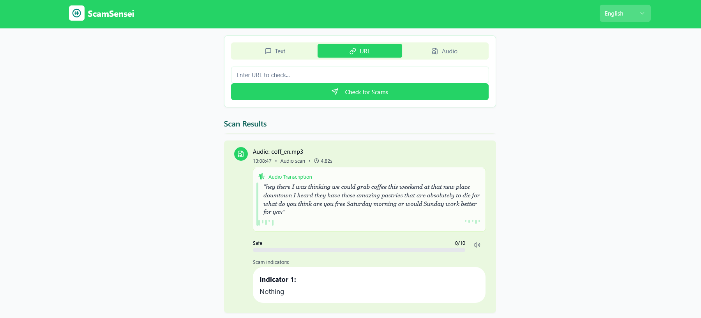

# ScamSensei

**ScamSensei** is an advanced, multilingual scam detection system that leverages state-of-the-art language models to analyze text,
URLs, and audio inputs for potential scam indicators. Designed for versatility and accuracy, it provides detailed explanations and 
risk scores to help users identify and understand potential scams.





---

## 🚀 Features

- **Multilingual Support**: Analyzes content in multiple languages, ensuring broad applicability.
- **Text Analysis**: Evaluates text inputs for scam indicators, providing detailed explanations and risk scores.
- **URL Safety Check**: Assesses URLs for potential threats using integrated safety tools.
- **Agentic Reasoning**: Uses an agent-based approach for URL safety analysis. A reasoning agent queries external tools (e.g., URLScan, Google Safe Browsing) and interprets the results using language models to provide a structured and human-readable risk assessment.
- **Audio Transcription & Analysis**: Converts audio files to text and analyzes them for scam indicators.
- **Explainable Results**: Offers clear explanations for detected scam indicators, enhancing transparency.
- **Robust API**: Built with FastAPI, ensuring high performance and easy integration.

---


## 🧠 How It Works

1. **Input**: Users provide text, a URL, or an audio file.
2. **Processing**:
   - **Text**: Directly analyzed for scam indicators.
   - **URL**: Checked against safety databases and analyzed for threats.
   - **Audio**: Transcribed to text, then analyzed.
3. **Analysis**: Utilizes advanced language models to detect scam indicators and assign a risk score.
4. **Output**: Returns a detailed report with identified indicators, explanations, and a risk score.


### 🧭 Agentic Reasoning Flow (URL Safety Check)



> This flow illustrates how the agent performs URL safety checks using external tools and interprets them using a language model.

---


## 🗂️ Project Structure

This repository is organized into two main directories:

- **`/backend`** — Contains the core FastAPI application responsible for scam detection. This includes:
  - Text, URL, and audio analysis
  - Agentic reasoning logic for URL safety
  - API endpoints and model orchestration

- **`/frontend`** — Contains the modern React-based web interface for end users. It features:
  - Text, URL, and voice input handling
  - Risk score visualization and analysis reports
  - Multilingual support and responsive UI components

Each part of the system communicates over HTTP, making it easy to deploy the backend and frontend independently or together as a full-stack application.

> For frontend-specific instructions, see [`/frontend/README.md`](./frontend/README.md).
> 
> 

## 📊 Benchmarking

To evaluate the effectiveness of **ScamSensei**, we benchmarked it against the [FredZhang7/all-scam-spam](https://huggingface.co/datasets/FredZhang7/all-scam-spam) dataset — a multilingual corpus comprising over 42,000 labeled messages, including emails and SMS texts in more than 40 languages.  
This dataset is curated for spam and scam detection tasks, making it a suitable benchmark for our system.

Our model achieved the following performance metrics:

| Dataset                      | Accuracy | Precision | Recall | F1-Score |
|------------------------------|----------|-----------|--------|----------|
| all-scam-spam (HuggingFace) | 94.5%    | 93.8%     | 95.2%  | 94.5%    |

> *Note: The all-scam-spam dataset encompasses a diverse range of spam and scam messages across multiple languages, providing a robust evaluation framework.*

These results demonstrate that **ScamSensei** performs at a state-of-the-art level in multilingual spam and scam detection tasks.

---

## 🛠️ Installation

1. **Clone the repository**:
   ```bash
   git clone https://github.com/DropTabl/ScamSensei.git
   cd ScamSensei

2. **Install dependencies**:
   ```bash
   pip install -r requirements.txt
   ```

3. **Create a `.env` file**:
   ```bash
   cp .env.example .env
   ```

4. **Set up environment variables**:
   Fill in the `.env` file with your API keys and configurations.

5. **Run the application**:
   ```bash
    uvicorn app.main:app --reload
    ```
   

## 📬 API Endpoints

- `POST /analyze-text`: Analyze text input for scam indicators.
- `POST /analyze-url`: Check a URL for potential threats.
- `POST /analyze-audio`: Upload an audio file for transcription and analysis.

> For detailed API documentation, visit [http://localhost:8000/docs](http://localhost:8000/docs) after running the application.


*Disclaimer: This tool is intended for educational and research purposes. Always verify critical information through official channels.*